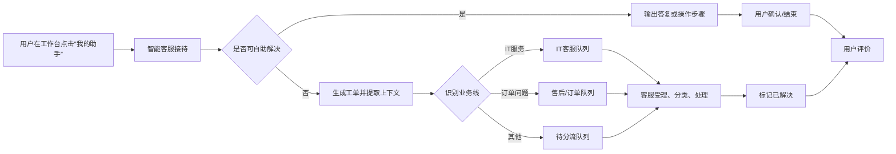

# ITSM桌面工单处理系统计划书（草案）

版本：V1.0  
日期：2026-08-25  
适用范围：用户侧、客服侧、管理员侧

## 1. 项目背景

本项目拟建设一套面向企业内部桌面支持与业务咨询的 ITSM 工单处理系统，覆盖用户咨询、智能客服首轮接待、人工分流、客服受理处理、工单闭环、用户评价与后台配置管理等能力。

从交互形态上看，用户侧采用“飞书式聊天工作台”作为主入口，客服侧采用“工单列表 + 工单详情”的处理模式，管理员侧提供工单字典、权限与分流规则的维护能力。系统的目标不是单纯做一个工单表单，而是把“问答、分流、处理、评价”串成一个连续的服务链路。

## 2. 建设目标

1. 让用户可以在一个统一入口中完成咨询、提交问题、追踪处理进度和评价服务体验。
2. 让智能客服优先处理可自动解决的问题，并在需要人工介入时，基于聊天记录自动识别业务线并分配工单。
3. 让客服能够快速受理工单，按照标准字典完成问题分类、原因定位与解决方法记录。
4. 让管理员能够维护工单可选项、权限体系和业务分流规则，保证系统可持续迭代。
5. 让系统具备基本的审计、历史追踪和运营分析能力，支持后续优化。

## 3. 角色定义

| 角色 | 定位 | 主要职责 |
| --- | --- | --- |
| 用户 | 提交问题的一方 | 登录、发起咨询、接收答复、确认解决、完成评价 |
| 智能客服 Agent | 首轮接待与分流 | 理解用户意图、自动答复、创建工单、转人工、生成摘要 |
| 普通客服 | 工单处理人员 | 受理工单、分类、排查、填写处理过程、置为已解决 |
| 管理员客服 | 配置与权限维护人员 | 维护字典项、业务线、分流规则、客服权限 |
| 主管/质检（可选） | 运营监督人员 | 查看统计、抽检工单、复盘分流与满意度 |

## 4. 参考界面映射

| 参考截图 | 对应能力 | 计划中的落点 |
| --- | --- | --- |
| 个人工作台 | 用户/客服首页入口 | 用户侧工作台首页、我的助手入口 |
| 服务请求列表 | 客服工单池 | 客服待受理、处理中、历史工单列表 |
| 配置页面 | 配置管理后台 | 管理单元、症状、原因、解决方法、权限配置 |
| 飞书聊天界面 | 对话式咨询入口 | 用户与智能客服的主交互界面 |

## 5. 总体业务流程

## 6. 功能范围

### 6.1 用户侧

- 登录与身份识别，支持企业统一身份体系接入。
- 工作台入口“我的助手”，默认进入聊天式交互界面。
- 咨询问题时，先由智能客服接待并尝试自动解决。
- 用户明确要求人工，或系统判断无法解决时，自动创建工单并转人工。
- 工单状态可见，用户可查看当前处理进度和历史记录。
- 工单关闭后，用户可提交满意度评价和补充说明。

### 6.2 客服侧

- 左侧菜单建议仅保留“首页”和“工单”，满足普通客服高频处理需求。
- 工单列表支持待受理、处理中、待确认、已解决、历史工单等视图。
- 客服点击“受理”后进入工单详情页，查看用户聊天摘要、问题背景和历史动作。
- 客服在处理过程中必须选择或补充工单管理单元、症状、原因、解决方法。
- 处理完成后将状态改为“已解决”，系统记录处理人、处理时间、处理意见。
- 支持历史工单检索、按工单号/用户/业务线/状态搜索。

### 6.3 管理员侧

- 维护工单可选字典：管理单元、症状、原因、解决方法。
- 维护业务线和分流规则，例如 IT 服务、订单、售后等。
- 维护客服权限与角色，区分普通客服、管理员客服、主管等。
- 查看配置变更记录，保证字典与权限的修改可追溯。
- 后续可增加知识库、SLA、报表和机器人策略配置。

## 7. 工单生命周期

| 状态 | 说明 | 主要触发条件 |
| --- | --- | --- |
| 新建 | 用户发起咨询或系统自动建单 | 用户咨询、关键词命中、人工转派 |
| 待受理 | 已进入客服队列，等待分配 | 分流成功后进入对应业务线 |
| 处理中 | 客服已接手并开始处理 | 客服点击受理 |
| 待用户确认 | 客服处理完成，等待用户确认 | 客服提交解决结果 |
| 已解决 | 问题处理完成 | 用户确认或超时自动确认 |
| 已关闭 | 工单生命周期结束 | 评价完成或超时关闭 |
| 重新打开 | 用户对结果不满意，要求继续处理 | 用户发起追问或不满意评价 |

## 8. 分类与字典设计

### 8.1 分类原则

- 业务线用于决定“派给谁”，例如 IT 服务、订单问题、售后问题。
- 管理单元用于决定“是什么场景”，例如网络问题、操作系统问题、浏览器问题。
- 症状用于描述“表现是什么”，例如无法登录、页面报错、收不到通知。
- 原因用于描述“为什么发生”，例如权限不足、网络异常、配置错误。
- 解决方法用于描述“怎么处理”，既支持标准答案，也支持客服自由补充。

### 8.2 字典维护建议

| 维度 | 示例 | 维护方式 |
| --- | --- | --- |
| 业务线 | IT支持、订单、售后 | 管理员配置 |
| 管理单元 | 网络、系统、浏览器、账号 | 树形字典 |
| 症状 | 无法登录、卡顿、报错、黑屏 | 可选项 + 自定义补充 |
| 原因 | 配置错误、权限缺失、系统故障 | 可选项 + 自定义补充 |
| 解决方法 | 重置密码、清缓存、调整权限、升级修复 | 标准模板 + 自由编辑 |

## 9. 权限模型

| 角色 | 可见菜单 | 核心操作 |
| --- | --- | --- |
| 普通客服 | 首页、工单 | 受理、分类、处理、关闭、查询历史 |
| 管理员客服 | 首页、工单、配置、权限 | 维护字典、管理角色、配置分流规则 |
| 主管/质检（可选） | 首页、工单、报表 | 抽检、统计、复盘、评分 |

建议采用 RBAC 权限模型，并把“菜单权限”和“数据权限”分开管理。普通客服只能处理自己业务线或被分配的工单，管理员可配置跨业务线规则。

## 10. 数据对象建议

| 对象 | 关键字段 | 用途 |
| --- | --- | --- |
| 用户 User | 用户ID、姓名、部门、联系方式 | 身份识别与工单归属 |
| 会话 Conversation | 会话ID、用户ID、业务线、摘要 | 记录聊天上下文 |
| 工单 Ticket | 工单号、状态、优先级、业务线、处理人 | 主业务对象 |
| 工单动作 TicketAction | 受理、转派、备注、解决、关闭 | 审计与过程追踪 |
| 字典项 DictionaryItem | 类型、编码、名称、父级ID | 管理单元与分类维护 |
| 评价 Rating | 满意度、标签、评论 | 结果反馈与运营分析 |
| 权限 Permission | 角色、菜单、按钮、数据范围 | 权限控制 |

## 11. 技术实现建议

- 前端采用三套主视图：用户聊天工作台、客服工单台、管理员配置台。
- 后端拆分为认证服务、会话服务、工单服务、分流服务、字典服务、权限服务、评价服务。
- 智能客服模块负责意图识别、摘要生成、分流建议和自动回复。
- 工单流转要保留完整聊天上下文，便于客服快速接手。
- 数据库建议以关系型数据库承载主数据，Redis 用于会话、队列和短期状态缓存。
- 所有工单动作、配置修改和权限调整都需要写审计日志。

## 12. 一期实施建议

### 12.1 一期建议范围

- 登录与基础身份接入
- 用户侧聊天式咨询与智能客服接待
- 自动建单与人工转派
- 客服受理、分类、解决、历史查询
- 管理员字典维护与权限管理
- 用户评价与工单关闭

### 12.2 二期及以后可扩展项

- 知识库检索与 FAQ 自动命中
- SLA 时效管理与超时升级
- 统计报表与运营看板
- 工单模板与行业方案沉淀
- 更精细的智能分流策略和推荐处理方法

### 12.3 里程碑建议

| 阶段 | 建议周期 | 交付物 |
| --- | --- | --- |
| 需求确认 | 1 周 | 需求边界、流程图、角色定义 |
| 原型设计 | 1 周 | 用户端、客服端、管理员端原型 |
| 核心开发 | 2-3 周 | 聊天、工单、分流、处理闭环 |
| 配置与权限 | 1 周 | 字典、角色、菜单、数据权限 |
| 联调测试 | 1 周 | 测试报告、缺陷修复、试运行方案 |

## 13. 验收标准

- 用户可以在工作台中通过“我的助手”完成咨询。
- 系统能够根据聊天记录自动创建工单，并按业务线分配到正确队列。
- 客服可以完成受理、分类、处理、解决和历史查询。
- 管理员可以维护管理单元、症状、原因、解决方法和客服权限。
- 用户可以对已解决工单进行评价，评价结果可追溯。
- 全流程有日志记录，关键动作可审计。

## 14. 风险与对策

- 风险：AI 分流不准。对策：规则优先、模型辅助、支持人工改派。
- 风险：字典维护过于复杂。对策：字典分层、限定必填项、保留自定义补充。
- 风险：客服处理习惯不统一。对策：标准处理模板、必填字段校验、权限分层。
- 风险：评价闭环不完整。对策：关闭前强制确认或超时自动关闭，并保留追评入口。

## 15. 结论

本计划书建议将 ITSM 系统定义为“聊天式智能接待 + 工单闭环处理 + 后台字典与权限配置”的一体化平台。第一阶段优先做通“用户发起咨询 - 智能分流 - 人工受理 - 问题解决 - 用户评价”这条主链路，再逐步补齐知识库、SLA、统计和更精细的智能分流能力。

