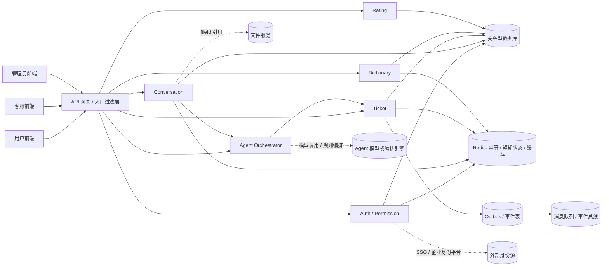
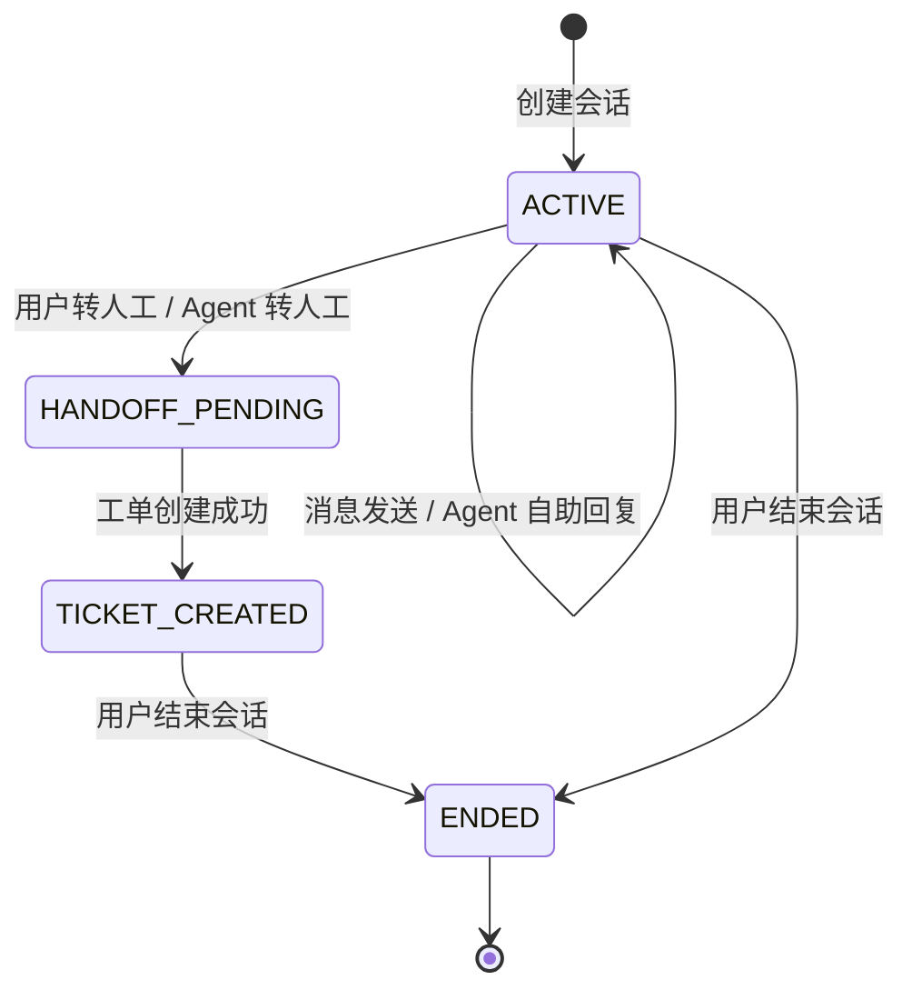
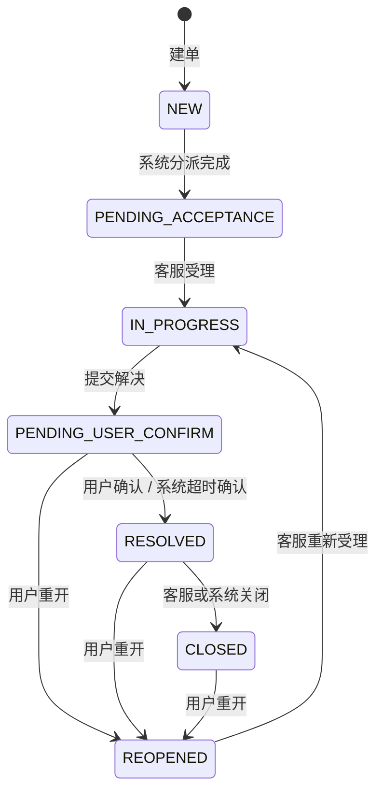

# ITSM 后端架构设计 v1.0

> 设计依据：
> - [计划书/ITSM桌面工单处理系统计划书.md](./计划书/ITSM桌面工单处理系统计划书.md)
> - [接口文档/ITSM一期核心接口产品分析与功能分类_v1.0.md](./接口文档/ITSM一期核心接口产品分析与功能分类_v1.0.md)
> - [接口文档/ITSM一期核心接口文档_v1.0.md](./接口文档/ITSM一期核心接口文档_v1.0.md)

## 1. 设计结论

一期后端建议采用“**模块化单体 + 领域边界清晰 + 未来可拆分**”的架构，而不是一开始就拆成多个物理微服务。

原因有三点：

1. 一期存在高耦合主链路：登录、会话、消息、Agent 决策、建单、受理、解决、确认、关闭、评价，这些步骤天然串联。
2. 一期强依赖一致性：工单状态机、状态历史、审计日志、幂等写入、租户隔离都要求强事务边界。
3. 现有仓库只有轻量 Maven 骨架，适合先用一个可运行的 `itsm-server` 承载所有对外接口，再按领域拆包，而不是先拆进程。

一句话概括：

> 一期把“服务拆分”当作**代码边界**，把“模块化单体”当作**部署形态**。

## 2. 总体架构图



## 3. 领域边界

| 领域 | 主要职责 | 一期是否核心 | 数据主权 |
| --- | --- | --- | --- |
| `auth-service` | 企业身份登录、当前用户、令牌签发、登录审计 | 是 | 令牌、用户登录态 |
| `permission-service` | 当前用户角色、菜单、按钮、数据权限查询 | 是 | 角色、权限、数据范围 |
| `conversation-service` | 会话创建、读取、消息存储、会话状态 | 是 | 会话、消息、会话摘要 |
| `agent-orchestrator` | Agent 决策接收、自助回复、转人工编排 | 是 | Agent 决策、编排任务 |
| `ticket-service` | 工单事实、状态机、分页、详情、受理、解决、关闭、重开 | 是 | 工单主数据、状态历史、动作日志 |
| `rating-service` | 工单评价、标签、满意度沉淀 | 是 | 评价数据 |
| `dictionary-service` | 业务线、管理单元、症状、原因、解决方法、评价标签 | 是 | 字典项 |

一期推荐的边界原则：

1. `auth-service` 只负责“你是谁”。
2. `permission-service` 只负责“你能看什么、能做什么”。
3. `conversation-service` 只负责“用户在聊什么”。
4. `agent-orchestrator` 只负责“Agent 怎么判断和怎么编排”，不直接改工单事实。
5. `ticket-service` 只负责“工单发生了什么”，它是工单状态机唯一执行者。
6. `dictionary-service` 只负责“可配置选项”，历史工单显示必须保留历史值。
7. `rating-service` 只负责“闭环反馈”。

## 4. 现有 Maven 模块落地方式

仓库当前有三个模块：

| 模块 | 建议定位 | 说明 |
| --- | --- | --- |
| `itsm-server` | 唯一可启动应用 | 承载 Spring Boot 启动类、Controller、应用服务、领域服务、基础设施适配器 |
| `itsm-common` | 通用基础设施包 | 放统一响应、错误码、异常、上下文、分页、审计、幂等、事件封装 |
| `itsm-pojo` | 领域模型和传输对象包 | 放实体、值对象、枚举、DTO、VO、命令对象 |

### 推荐的长期演进

`itsm-common` 和 `itsm-pojo` 最好在后续逐步退化为**纯依赖模块**，不再各自作为独立 Spring Boot 应用启动。最终应只有 `itsm-server` 是运行入口。

如果后续要拆物理服务，优先按这些边界拆：

`auth-service`、`permission-service`、`conversation-service`、`agent-orchestrator`、`ticket-service`、`rating-service`、`dictionary-service`。

## 5. 分层设计

建议在 `itsm-server` 内按四层组织代码：

```text
interfaces
  - REST Controller
  - Request/Response DTO
  - 参数校验

application
  - 用例编排
  - 事务边界
  - 命令/查询处理

domain
  - 聚合根
  - 实体 / 值对象
  - 领域服务
  - 状态机

infrastructure
  - 数据访问
  - Redis / MQ / Outbox
  - 外部系统适配器
  - 安全与审计实现
```

### 分层职责约束

1. Controller 只做协议解析、基础校验和返回包装，不直接改状态。
2. Application 层负责事务、幂等、权限上下文装配、领域调用顺序。
3. Domain 层负责状态机、规则、聚合一致性。
4. Infrastructure 层负责数据库、缓存、消息、外部系统。

## 6. 关键聚合与数据主对象

| 聚合 / 对象 | 所属领域 | 核心字段 | 说明 |
| --- | --- | --- | --- |
| `Tenant` | auth / permission | `tenantId`、`tenantName`、`enabled` | 租户边界的根对象 |
| `User` | auth / permission | `userId`、`displayName`、`departmentName`、`tenantId` | 身份主体 |
| `Role` / `Permission` | permission | `roleCode`、`permissionCode`、`dataScope` | 菜单、按钮、数据范围 |
| `ConversationSession` | conversation | `sessionId`、`userId`、`tenantId`、`status`、`summary`、`ticketId` | 会话上下文容器 |
| `ConversationMessage` | conversation | `messageId`、`sessionId`、`senderType`、`content`、`attachments` | 聊天消息事实 |
| `AgentDecision` | agent | `decision`、`confidence`、`businessLineCode`、`handoffReason` | 结构化决策记录 |
| `Ticket` | ticket | `ticketId`、`ticketNo`、`status`、`priority`、`businessLineCode`、`requesterId`、`assigneeId` | 工单主聚合 |
| `TicketStatusHistory` | ticket | `fromStatus`、`toStatus`、`operatorId`、`occurredAt` | 状态审计轨迹 |
| `TicketClassification` | ticket | `managementUnitId`、`symptomId`、`reasonId`、`solutionMethodId`、`customReason`、`customSolution` | 客服标准分类 |
| `TicketActionLog` | ticket | `actionType`、`operatorId`、`actionContent` | 处理动作流水 |
| `Rating` | rating | `ticketId`、`score`、`tags`、`comment` | 闭环评价 |
| `DictionaryItem` | dictionary | `dictType`、`code`、`name`、`parentId`、`enabled`、`version` | 配置型字典 |
| `AuditLog` | all | `tenantId`、`operatorId`、`actionType`、`resourceType`、`resourceId` | 所有关键动作审计 |
| `IdempotencyRecord` | all command APIs | `tenantId`、`callerId`、`method`、`path`、`requestHash`、`responseSnapshot` | 幂等去重 |
| `OutboxEvent` | all write flows | `eventType`、`payload`、`publishedAt`、`status` | 可靠事件投递 |

## 7. 核心状态机

### 7.1 会话状态



### 7.2 工单状态



### 7.3 字典状态

字典项只有两个事实状态：

1. `enabled=true`，可用于新工单和下拉选择。
2. `enabled=false`，不再给新工单使用，但历史工单仍可展示。

## 8. 关键流程设计

### 8.1 登录

1. 前端携带企业 SSO 凭证调用 `auth-service`。
2. `auth-service` 校验 SSO，落登录审计，签发 `accessToken` 和 `refreshToken`。
3. 返回用户、租户、角色、权限版本和令牌摘要。
4. 前端后续请求统一带 `Authorization` 和 `X-Tenant-Id`。

### 8.2 发消息与 Agent 编排

1. `conversation-service` 先持久化用户消息。
2. 生成 `UserMessageSent` 事件或待处理任务。
3. `agent-orchestrator` 基于会话上下文和消息内容做结构化判断。
4. 如果可自助解决，写入 Agent 回复并保持会话 `ACTIVE`。
5. 如果需要人工，触发转人工，调用 `ticket-service` 创建工单并把会话置为 `TICKET_CREATED`。

### 8.3 建单到受理

1. `ticket-service` 接收用户手动建单或 Agent 转人工建单。
2. 创建 `Ticket`、状态历史、审计日志、分派事件。
3. 进入 `PENDING_ACCEPTANCE`。
4. 客服在队列中看到该工单后受理，工单转为 `IN_PROGRESS`。

### 8.4 客服处理到闭环

1. 客服补齐管理单元、症状、原因、解决方法。
2. 提交解决结果后工单进入 `PENDING_USER_CONFIRM`。
3. 用户确认后工单进入 `RESOLVED`。
4. 客服或系统任务关闭后进入 `CLOSED`。
5. 用户可在 `RESOLVED` 或 `CLOSED` 状态发起重开，重新进入 `REOPENED`。

### 8.5 评价

1. 用户只能评价自己的工单。
2. 评价只允许对 `RESOLVED` 或 `CLOSED` 工单提交。
3. 一期每个工单只允许一条当前评价。

## 9. 一致性、幂等与并发控制

### 9.1 幂等

所有命令接口必须支持 `Idempotency-Key`，至少覆盖：

`会话创建`、`消息发送`、`转人工`、`建单`、`受理`、`分类更新`、`提交解决`、`确认`、`关闭`、`重开`、`评价`、`字典写操作`。

建议策略：

1. 以 `tenantId + callerId + method + path + Idempotency-Key` 作为幂等键。
2. 先查幂等记录，再执行业务。
3. 已处理过的请求直接返回首次结果。
4. 同键不同体返回冲突。
5. 幂等记录至少保留 24 小时。

### 9.2 并发控制

1. 工单受理使用乐观锁或行锁，防止双人抢单。
2. 字典更新使用版本号，避免并发覆盖。
3. 确认、关闭、重开必须做状态机校验，不允许前端猜状态。
4. `ticket-service` 是工单状态的唯一事实来源，`agent-orchestrator` 不能直接把工单置为 `RESOLVED` 或 `CLOSED`。

### 9.3 事务与事件

所有关键写操作都应遵循这个顺序：

1. 校验租户、权限、状态、参数。
2. 在同一事务里写业务事实、状态历史、审计日志。
3. 写 Outbox 事件。
4. 事务提交后由后台发布器把事件投递到消息总线或内部订阅者。

这样可以避免“数据库已变更，但领域事件丢失”的情况。

## 10. 安全与租户隔离

### 10.1 请求头

必须信任的头：

1. `Authorization`
2. `X-Tenant-Id`
3. `X-Trace-Id`
4. `Idempotency-Key`

必须不信任的头：

`X-User-Id`、`X-Operator-Id`、`X-Role`、`X-User-Type`

### 10.2 权限判断顺序

1. 认证令牌有效性。
2. `X-Tenant-Id` 与令牌租户一致性。
3. 功能权限，例如 `ticket:accept`。
4. 数据权限，例如业务线、处理人、本人。
5. 工单状态是否允许操作。
6. 参数和字典项校验。

### 10.3 访问控制原则

1. 用户只能操作本人工单。
2. 客服只能操作本租户、且在其数据范围内的工单。
3. Agent 服务只能提交决策和建议，不能越权修改工单事实。
4. 字典停用后不能再被新工单选择，但历史工单必须可展示。

## 11. 存储与缓存建议

### 11.1 主存储

使用关系型数据库承载所有事实数据：

1. 用户、角色、权限。
2. 会话、消息、Agent 决策。
3. 工单、状态历史、动作日志、分类、评价。
4. 字典项、审计日志、幂等记录、Outbox 事件。

### 11.2 Redis

Redis 适合放短期或高频数据，不适合作为事实源：

1. 幂等键记录。
2. 会话和队列的热点缓存。
3. 权限和字典的短期缓存。
4. Agent 异步任务的临时状态。

### 11.3 索引建议

关键索引至少包括：

1. `tenant_id + ticket_no`
2. `tenant_id + ticket_id`
3. `tenant_id + session_id`
4. `tenant_id + dict_type + code`
5. `tenant_id + role_code`
6. `tenant_id + requester_id`
7. `tenant_id + assignee_id`
8. `tenant_id + created_at / updated_at`

## 12. 外部集成

### 12.1 企业 SSO

`auth-service` 应封装成独立适配器，屏蔽具体 SSO 厂商差异。

### 12.2 文件服务

接口只接受 `fileId`，后端不直接接收文件二进制。

建议做法：

1. 附件表只存 `fileId` 和必要的展示快照。
2. 文件大小、类型、病毒扫描由文件服务承担。
3. 会话消息和工单附件都只引用文件，不承担上传职责。

### 12.3 Agent 模型或编排引擎

`agent-orchestrator` 只关心三件事：

1. 会话上下文。
2. 结构化决策。
3. 转人工结果。

内部模型提示词、阈值、重试和降级策略不要暴露给前端，也不要作为工单事实字段。

## 13. 建议的包结构

```text
com.cenziang.itsmserver
  ├── interfaces
  │   ├── auth
  │   ├── conversation
  │   ├── ticket
  │   ├── rating
  │   ├── dictionary
  │   └── permission
  ├── application
  │   ├── auth
  │   ├── conversation
  │   ├── agent
  │   ├── ticket
  │   ├── rating
  │   ├── dictionary
  │   └── permission
  ├── domain
  │   ├── auth
  │   ├── conversation
  │   ├── agent
  │   ├── ticket
  │   ├── rating
  │   ├── dictionary
  │   └── permission
  └── infrastructure
      ├── persistence
      ├── security
      ├── cache
      ├── event
      └── integration
```

## 14. 一期实施顺序

### P0

1. `auth-service`
2. `permission-service` 的 `me` 查询
3. `conversation-service`
4. `agent-orchestrator`
5. `ticket-service` 的建单、队列、受理、分类、解决、确认、关闭、重开

### P1

1. `rating-service`
2. `dictionary-service` 的增删改停用
3. 审计查询
4. 运营统计

### 后续扩展

1. 知识库和 FAQ 检索
2. SLA 和自动升级
3. 更细的分流策略
4. 主管抽检和报表

## 15. 与接口文档的一致性约束

这份架构设计必须严格遵守接口文档中的几个硬约束：

1. 工单状态由 `NEW`、`PENDING_ACCEPTANCE`、`IN_PROGRESS`、`PENDING_USER_CONFIRM`、`RESOLVED`、`CLOSED`、`REOPENED` 组成。
2. Agent 不得直接修改工单事实状态。
3. 分类、原因、解决方法在提交解决前必须完成。
4. 所有命令接口都必须幂等。
5. 所有持久化对象都要带 `tenantId`。
6. 关键动作必须写状态历史、审计日志和领域事件。
7. 字典项只能软停用，不能物理删除。

## 16. 最终建议

如果现在就开始动代码，我建议按这个顺序落地：

1. 先把统一响应、异常、租户上下文、幂等、审计、状态机这些基础设施放进 `itsm-common`。
2. 再把 `auth`、`permission`、`conversation`、`ticket` 的最小闭环打通。
3. 接着补 `agent-orchestrator` 和 `dictionary`。
4. 最后补 `rating`、审计查询和后台维护能力。

这样可以最先交付“用户能聊、客服能接、工单能闭、评价能回收”的主价值链。
