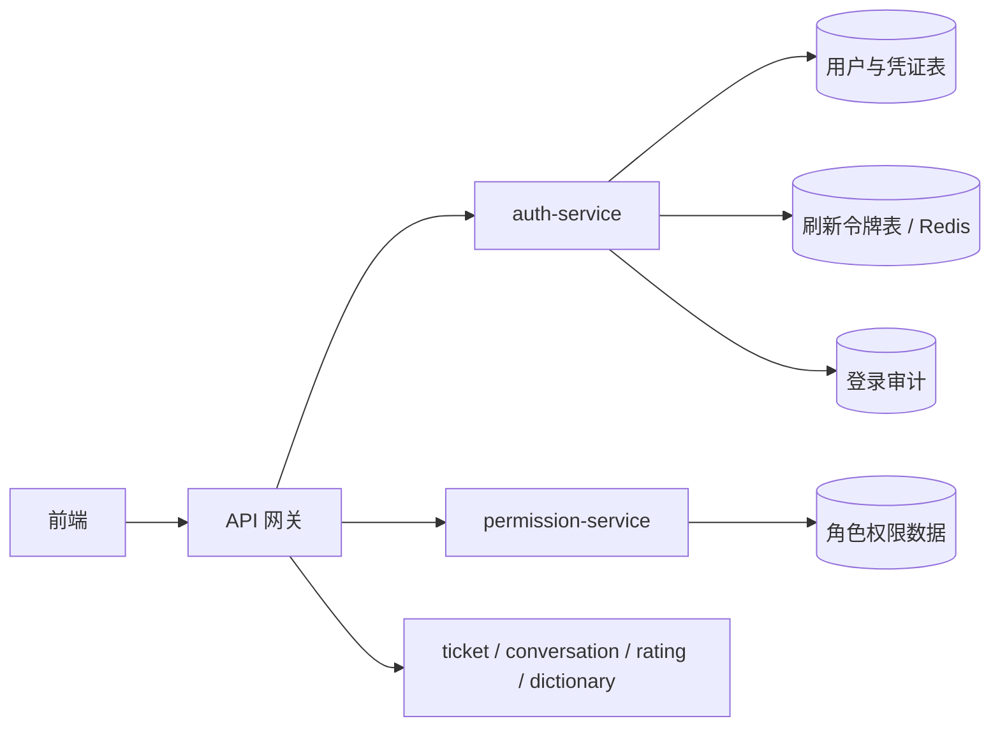

# ITSM 登录方案 v1.0

> 依据：
> - [计划书/ITSM桌面工单处理系统计划书.md](./计划书/ITSM桌面工单处理系统计划书.md)
> - [接口文档/ITSM一期核心接口文档_v1.0.md](./接口文档/ITSM一期核心接口文档_v1.0.md)
> - [后端架构设计_v1.0.md](./后端架构设计_v1.0.md)

## 1. 方案目标

一期登录方案围绕 `auth-service` 展开，统一解决三件事：

1. 用户登录后获得可跨服务使用的 JWT 访问令牌。
2. 用户密码只保存哈希值，不保存明文密码和可逆密钥。
3. 后端把“认证”和“权限”拆开，认证负责“你是谁”，权限负责“你能做什么”。

这份方案与现有计划书和接口书的关系是：

- 计划书明确要求“登录与基础身份接入”，并且后端拆分为认证服务和权限服务。
- 接口书已经定义了 `/api/v1/auth/login` 和 `/api/v1/auth/me`，以及 `Authorization: Bearer <accessToken>` 的统一鉴权方式。
- 本方案在不改变整体接口形态的前提下，把登录令牌明确为 JWT，并补齐密码哈希存储、刷新、退出和风控规则。

## 2. 设计原则

1. 令牌签发统一由 `auth-service` 负责。
2. 访问令牌采用 JWT，做到前端、网关和业务服务可独立验签。
3. 刷新令牌采用可撤销的服务端存储，不把长生命周期凭证完全放到前端。
4. 密码只存哈希，不存明文，不存可逆加密密文。
5. 登录、刷新、退出、改密都要写审计日志。
6. 多租户隔离以 `tenant_id` 为边界，不能只信任前端传参。
7. `auth-service` 只负责认证，`permission-service` 只负责权限查询和权限版本管理。

## 3. 总体架构



### 3.1 认证链路

- 前端提交账号密码或企业身份凭证给 `auth-service`。
- `auth-service` 校验身份后签发 `accessToken` 和 `refreshToken`。
- 前端后续请求统一携带 `Authorization: Bearer <accessToken>`。
- 网关或业务服务验签 JWT，并检查 `X-Tenant-Id` 与 token 中的 `tenant_id` 是否一致。
- 权限信息不直接写死在前端，由 `permission-service` 提供最新权限版本和权限明细。

### 3.2 令牌分工

- `accessToken`：JWT，短时有效，主要给业务接口使用。
- `refreshToken`：随机字符串，长时有效，服务端保存哈希，可撤销、可轮换。

这样做的好处是：

- 业务服务无需频繁访问认证库就能验签。
- 退出登录、密码修改、账号冻结时，可以通过刷新令牌失效和认证版本号升级来快速收口。
- 访问令牌泄露后的风险窗口较短。

## 4. 登录模式

一期建议把登录入口做成统一的 `auth/login`，支持两类凭证模式：

| 模式 | 说明 | 一期建议 |
| --- | --- | --- |
| `PASSWORD` | 用户名 + 密码登录 | 作为当前落地主模式 |
| `SSO_CODE` | 企业统一身份平台一次性授权码登录 | 作为后续扩展或保留兼容模式 |

这样可以同时满足两个现实：

1. 计划书里“企业统一身份接入”的方向。
2. 你现在提出的“用户密码使用哈希保存”的落地要求。

如果当前项目一期先落本地账号体系，可以先以 `PASSWORD` 为主；如果后续企业 SSO 到位，`auth-service` 只需要新增一个凭证提供方，JWT 结构和前端鉴权方式都不需要重做。

## 5. 账号与密码存储

### 5.1 用户资料与凭证分离

建议把“用户资料”和“登录凭证”拆开，避免一个表同时承载展示信息和安全敏感字段。

#### `app_user`

保留用户资料：

- `user_id`
- `tenant_id`
- `display_name`
- `department_name`
- `contact_phone`
- `contact_email`
- `enabled`

#### `user_credential`

新增登录凭证表，建议字段如下：

| 字段 | 说明 |
| --- | --- |
| `credential_id` | 主键 |
| `tenant_id` | 租户隔离 |
| `user_id` | 关联用户 |
| `login_name` | 登录账号，通常是工号、邮箱、手机号或统一账号 |
| `password_hash` | 密码哈希值，保存编码后的完整结果 |
| `password_algo` | 哈希算法标识，例如 `bcrypt` |
| `password_version` | 密码版本，便于未来平滑升级算法 |
| `auth_version` | 认证版本号，改密、注销全部会话、冻结账号时递增 |
| `failed_count` | 连续失败次数 |
| `locked_until` | 锁定截止时间 |
| `last_login_at` | 最近登录时间 |
| `last_login_ip` | 最近登录 IP |
| `status` | 凭证状态，正常、锁定、停用 |

`login_name` 必须在同一租户内唯一。这样既支持账号密码，也支持未来统一身份映射。

### 5.2 密码哈希策略

推荐一期使用 `BCrypt`：

- 成熟稳定，Spring 生态直接可用。
- 自带随机 salt。
- 参数调整简单，便于后续提高计算成本。

保存时只落库哈希后的字符串，不单独保存明文密码和单独 salt。

建议规则：

- 哈希前先做标准化处理，避免前后端字符集差异。
- 校验采用常量时间比较，避免时序攻击。
- 密码长度建议限制在 8 到 64 个可见字符之间。
- 密码复杂度至少要求字母和数字组合，管理员账号可要求更高复杂度。

如果未来需要更强的抗 GPU 计算能力，可以把 `password_algo` 平滑切换到 `argon2id`，而不影响 JWT 结构。

## 6. JWT 设计

### 6.1 签名算法

建议使用 `RS256`：

- `auth-service` 持有私钥并负责签发。
- 网关和业务服务持有公钥并负责验签。
- 便于密钥轮换，避免所有服务共享同一把对称密钥。

JWT Header 建议包含：

```json
{
  "alg": "RS256",
  "typ": "JWT",
  "kid": "itsm-key-20260825"
}
```

### 6.2 Access Token Claims

建议的核心声明如下：

| Claim | 含义 |
| --- | --- |
| `iss` | 令牌签发方，例如 `itsm-auth-service` |
| `aud` | 令牌受众，标识 ITSM 业务系统 |
| `sub` | 用户主键 `user_id` |
| `tenant_id` | 当前租户 |
| `roles` | 用户角色列表 |
| `perm_ver` | 当前权限版本 |
| `auth_ver` | 当前认证版本 |
| `jti` | 令牌唯一 ID |
| `iat` | 签发时间 |
| `nbf` | 生效时间 |
| `exp` | 过期时间 |
| `token_type` | 固定为 `access` |

示例：

```json
{
  "iss": "itsm-auth-service",
  "aud": "itsm",
  "sub": "usr_10001",
  "tenant_id": "tenant_001",
  "roles": ["USER"],
  "perm_ver": "perm_20260825_01",
  "auth_ver": 3,
  "jti": "jti_01J8V9X6Q7",
  "iat": 1756080000,
  "nbf": 1756080000,
  "exp": 1756087200,
  "token_type": "access"
}
```

### 6.3 有效期建议

- `accessToken`：沿用接口文档现有约定，建议 7200 秒。
- `refreshToken`：建议 7 天到 14 天。
- 刷新令牌支持轮换，旧 token 在新 token 成功签发后立即失效。

## 7. 登录流程

### 7.1 密码登录主流程

1. 前端提交 `X-Tenant-Id`、账号和密码到 `/api/v1/auth/login`。
2. `auth-service` 校验租户是否存在且启用。
3. `auth-service` 根据 `tenant_id + login_name` 查找凭证。
4. 校验账号状态、锁定状态和失败次数。
5. 使用哈希算法比对密码。
6. 命中后加载用户资料、角色和最新权限版本。
7. 签发 `accessToken` 和 `refreshToken`。
8. 写登录成功审计，更新最近登录时间、IP 和失败计数。
9. 返回给前端用户、租户、角色和权限版本摘要。

### 7.2 失败流程

- 账号不存在、密码错误、租户不匹配都返回统一错误，不暴露账号是否存在。
- 连续失败达到阈值后锁定一段时间。
- 账号停用或租户停用时直接拒绝。
- 所有失败都要写安全审计，但不能记录明文密码。

### 7.3 前端持久化建议

- `accessToken` 保存在内存或受控存储中，避免明文长时间暴露。
- `refreshToken` 建议放在 `HttpOnly + Secure + SameSite` Cookie，或者放在受控存储中并做严格保护。
- 前端不要自行解密或篡改 token 内容，只做展示与请求透传。

## 8. 关键接口建议

### 8.1 登录

`POST /api/v1/auth/login`

请求示例：

```json
{
  "grantType": "PASSWORD",
  "account": "zhangsan",
  "password": "P@ssw0rd123",
  "redirectUri": "https://itsm.example.com/login/callback"
}
```

如果继续兼容企业身份登录，则同一接口也可以支持：

```json
{
  "grantType": "SSO_CODE",
  "ssoCode": "one-time-code",
  "redirectUri": "https://itsm.example.com/login/callback"
}
```

响应建议保持与现有接口文档一致：

```json
{
  "code": "SUCCESS",
  "message": "success",
  "data": {
    "accessToken": "eyJ...",
    "refreshToken": "rt_...",
    "tokenType": "Bearer",
    "expiresIn": 7200,
    "user": {
      "userId": "usr_10001",
      "displayName": "张三",
      "departmentName": "技术支持部"
    },
    "tenant": {
      "tenantId": "tenant_001",
      "tenantName": "示例企业"
    },
    "roles": ["USER"],
    "permissionsVersion": "perm_20260825_01"
  },
  "traceId": "trc_login_001",
  "details": null
}
```

### 8.2 当前登录用户

`GET /api/v1/auth/me`

这个接口保持现有契约即可：

- 通过 `Authorization` 读取当前用户。
- 从 token 中解析 `user_id` 和 `tenant_id`。
- 不接受前端通过 Body 或 Query 传入另一个用户 ID。

### 8.3 刷新令牌

建议新增：

`POST /api/v1/auth/refresh`

职责：

- 使用 refreshToken 换取新的 accessToken。
- 轮换 refreshToken。
- 校验 `auth_ver` 和租户一致性。

### 8.4 退出登录

建议新增：

`POST /api/v1/auth/logout`

职责：

- 撤销当前 refreshToken。
- 必要时提升 `auth_version`，让旧 accessToken 尽快失效。

## 9. 鉴权与权限边界

### 9.1 验证顺序

1. 验证 JWT 签名和过期时间。
2. 校验 `tenant_id` 与 `X-Tenant-Id` 一致。
3. 校验 `auth_ver` 是否仍然有效。
4. 读取 `permission-service` 的权限版本与权限明细。
5. 校验具体功能权限和数据权限。

### 9.2 边界说明

- `auth-service` 不负责工单、会话、字典等业务数据。
- `permission-service` 不负责认证，只负责当前用户角色和权限查询。
- 业务服务不能相信 `X-User-Id`、`X-Role` 这类不可信 Header。

## 10. 安全控制

1. 全链路必须走 HTTPS。
2. 登录接口需要限流，必要时接验证码或二次校验。
3. 连续失败触发锁定和告警。
4. 密码、token、ssoCode、refreshToken 都不能写入普通业务日志。
5. 登录成功、失败、改密、退出、冻结、解冻都要写审计日志。
6. 密钥必须支持轮换，JWT Header 使用 `kid` 标识当前签名密钥。
7. 刷新令牌必须可撤销，不能像 accessToken 一样只靠自然过期。
8. 用户改密后，旧会话全部失效。

## 11. 与现有文档的对齐点

### 11.1 与计划书对齐

- 计划书要求“登录与基础身份接入”，本方案把它落实为 `auth-service + JWT + 密码哈希`。
- 计划书要求“权限模型 RBAC”，本方案把角色和权限版本放入 `permission-service`。
- 计划书强调审计，本方案把登录、退出、改密都纳入审计。

### 11.2 与接口书对齐

- `Authorization` 仍然是后续业务接口的统一鉴权头。
- `X-Tenant-Id` 仍然是租户边界头，且必须与 token 一致。
- `/api/v1/auth/me` 保持不变。
- `/api/v1/auth/login` 的响应结构保持不变，便于前端直接复用。

### 11.3 需要确认的一点

现有接口书的登录示例偏向 `SSO_CODE`。如果一期最终采用账号密码登录，需要把 `grantType` 的定义补成 `PASSWORD`，或者明确把 `SSO_CODE` 保留为后续扩展登录方式。  
本方案建议：**接口形态不变，凭证模式扩展为双模式，JWT 结构保持统一**。

## 12. 结论

这一版登录方案的核心结论很简单：

- 认证用 JWT。
- 密码用哈希保存。
- 认证和权限分离。
- 前端、网关和业务服务共享同一套 token 规则。
- 登录接口保持单一入口，后续无论接账号密码还是企业 SSO，都不需要推倒重来。

这能把一期最核心的登录链路先稳稳落下来，后面再接会话、工单、权限和审计，就会顺很多。
